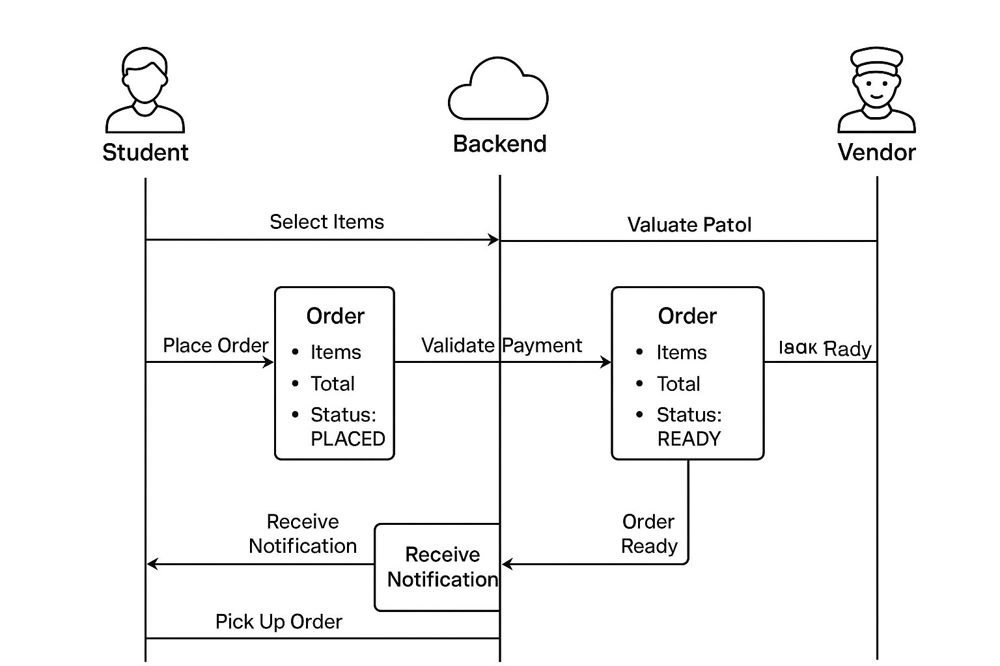

# 🍴 College Canteen Ordering System

A **college-only food ordering platform** to streamline lunch ordering, reduce queues, and simplify payments. Think of it as a **micro-Zomato/Swiggy for your campus**.

---

## 🎯 Problem Statement

During lunch breaks, college canteens get chaotic:

- Long queues waste students’ time.
- Miscommunication between vendors and students.
- Payment confusion (paid but didn’t get food, or got food without paying).

**Goal:** Build a system where:

1. Students order & pay online.
2. Vendors receive incoming orders and update status.
3. Students get notified when food is ready for pickup.

---

## 🔑 Core Features

### Student App
- Login via college email/ID.
- Browse menu & place orders.
- Online payment (UPI, wallet, or in-app credits).
- Notifications for:
  - Order Placed
  - Order Being Prepared
  - Order Ready

### Vendor Dashboard
- New orders queue.
- Update order status: Pending → Preparing → Ready.
- Payment verification (cash-free workflow).

### Admin (Optional)
- Add/remove vendors & manage menus.
- Analytics: daily orders, revenue, popular items.

---

## 🏗️ Architecture

**1. Frontend**  
- React (Web) / React Native (Mobile) for students.  
- Web dashboard for vendors.

**2. Backend**  
- Node.js + NestJS / Express (TypeScript) for APIs.  
- Firebase Auth / Auth0 / Cognito for authentication.  
- Supabase 
- Razorpay / Stripe for payments.  
- Firebase Cloud Messaging (FCM) for notifications.

**3. Event-Driven Flow**
1. Student places order → Event published to `Orders` queue.
2. Payment confirmation triggers `Order Placed`.
3. Vendor dashboard subscribes → sees new orders.
4. Vendor updates status → triggers notification → student notified.

---

## ⚡ Workflow Example

1. Student orders “Paneer Roll” at 12:10 PM.
2. Payment successful → Vendor dashboard shows new order.
3. Vendor marks **Preparing → Ready**.
4. Student receives push notification:  
   *"Your Paneer Roll is ready! Collect it from Counter 2."*
5. Student shows QR code → vendor confirms delivery.

---

## 🛠️ Tech Stack

| Layer          | Technology                                     | Purpose/Benefit |
|----------------|-----------------------------------------------|----------------|
| Frontend       | React / React Native                           | Web & mobile apps |
| Backend        | Node.js + NestJS / Express + TypeScript       | Scalable APIs |
| Database       | PostgreSQL (+ Redis optional)                  | Orders, users, menu storage |
| Auth           | Firebase Auth / Auth0 / Cognito               | Secure college login |
| Payments       | Razorpay / Stripe                             | Cashless payments |
| Notifications  | Firebase Cloud Messaging (FCM)                | Real-time push notifications |
| Hosting/Cloud  | AWS Lambda / S3 / Firebase                     | Serverless, low-cost deployment |
| CI/CD          | GitHub Actions                                | Automate build & deploy |

---

## 🚀 Future Enhancements
- Pre-ordering & scheduled meals.
- Loyalty points, discounts, and coupons.
- AI-based demand prediction for vendors.
- Integration with hostel mess / multiple canteens.
- Analytics dashboards for admins.

---

## 💻 Installation (MVP Version)

1. ## Clone the repo:  
   ```bash
   git clone https://github.com/<username>/college-canteen-app.git
2. ## Install Frontend Dependencies
   ```bash
   cd frontend
   npm install
3. ## Configure Environment Variables
   ```bash
   DATABASE_URL → PostgreSQL connection URL
   RAZORPAY_KEY_ID & RAZORPAY_KEY_SECRET → Razorpay credentials
   FIREBASE_CONFIG → Firebase configuration for FCM & Auth
4. ## Run Backend
   ```bash
   npm run start:dev
5. ## Run Frontend
   ```bash
   npm start

## 🚦 API Routes**

### 🧑‍💻 A. Auth Routes (`/api/auth`)

| Method | Endpoint     | Auth | Description          |
|:-------|:--------------|:-----|:--------------------|
| **POST** | `/register` | ❌ No  | Register new user |
| **POST** | `/login` | ❌ No  | Login user |
| **GET** | `/profile` | ✅ Yes | Get user profile |

---

### 🏪 B. Vendor Routes (`/api/vendors`)

| Method | Endpoint     | Auth | Role | Description          |
|:-------|:--------------|:-----|:------|:--------------------|
| **POST** | `/` | ✅ Yes | Vendor | Create vendor |
| **GET** | `/` | ❌ No | - | Get all vendors |
| **GET** | `/:id` | ❌ No | - | Get vendor by ID |
| **PUT** | `/:id` | ✅ Yes | Vendor | Update vendor |

---

### 🍔 C. Menu Routes (`/api/menu`)

| Method | Endpoint     | Auth | Role | Description          |
|:-------|:--------------|:-----|:------|:--------------------|
| **POST** | `/` | ✅ Yes | Vendor | Create menu item |
| **GET** | `/vendor/:vendorId` | ❌ No | - | Get vendor's menu |
| **PUT** | `/:id` | ✅ Yes | Vendor | Update menu item |
| **DELETE** | `/:id` | ✅ Yes | Vendor | Delete menu item |

---

### 🧾 D. Order Routes (`/api/orders`)

| Method | Endpoint     | Auth | Role | Description          |
|:-------|:--------------|:-----|:------|:--------------------|
| **POST** | `/` | ✅ Yes | Student | Create order |
| **GET** | `/my-orders` | ✅ Yes | Student | Get my orders |
| **GET** | `/:id` | ✅ Yes | Any | Get order by ID |
| **GET** | `/vendor/:vendorId` | ✅ Yes | Vendor | Get vendor orders |
| **PUT** | `/:id/status` | ✅ Yes | Vendor | Update order status |

